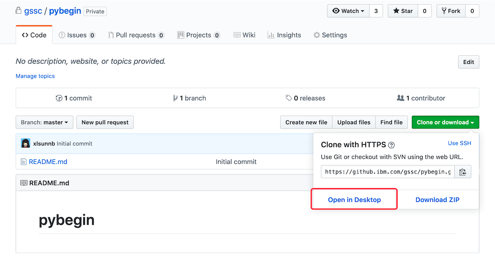
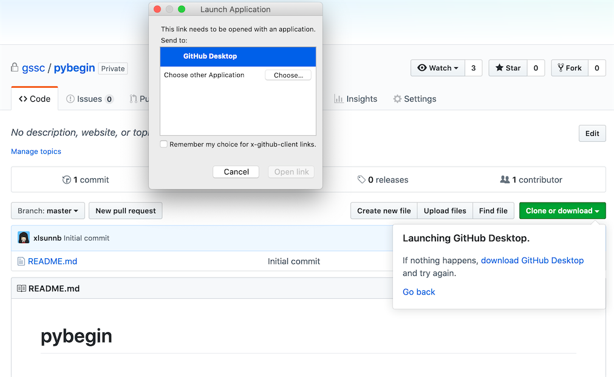
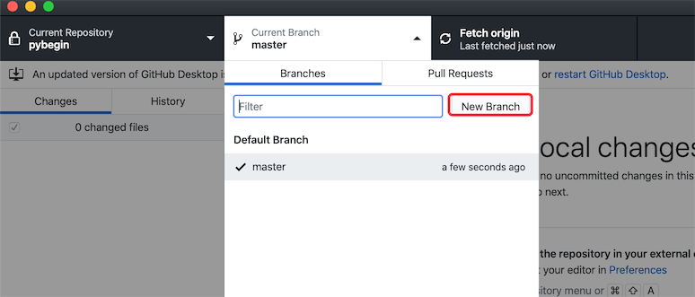
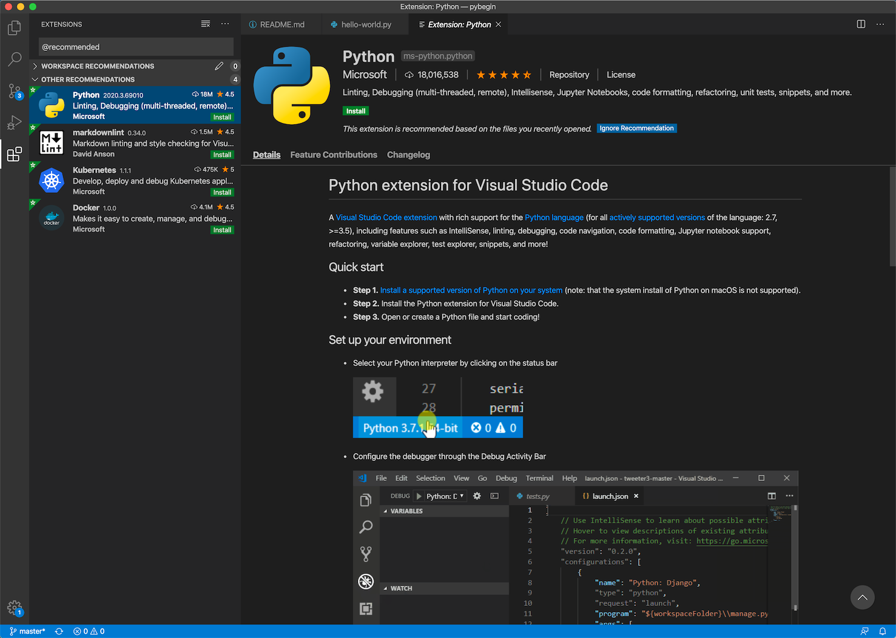
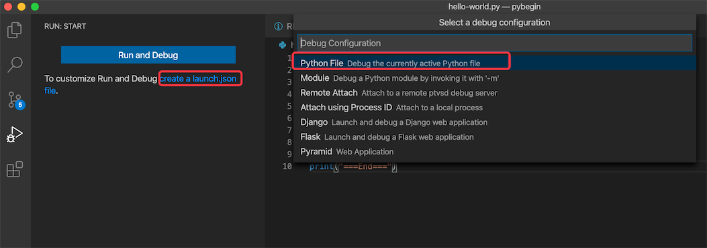
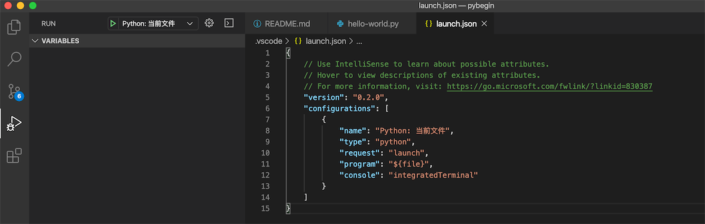
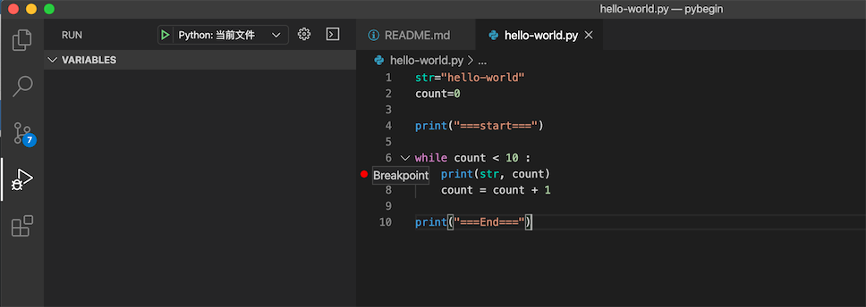
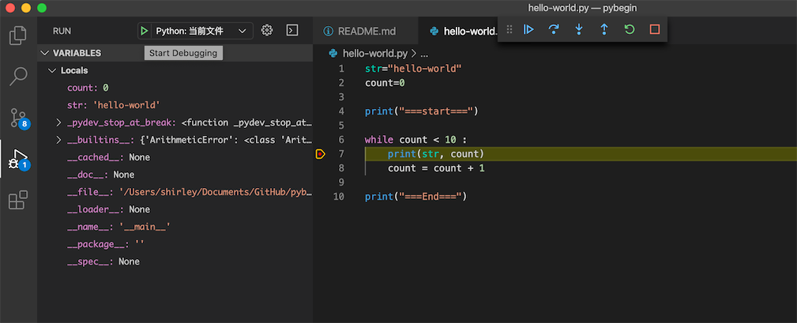

# Python for Beginners

## Environment
- IDE: [Microsoft Visual Studio Code](https://visualstudio.microsoft.com/zh-hans/free-developer-offers/)
- Python: [Python-official-website](https://www.python.org/)

## Reference
- [Python 3 教程 | 菜鸟教程](https://www.runoob.com/python3/python3-tutorial.html)
- [Python教程 | 廖雪峰](https://www.liaoxuefeng.com/wiki/1016959663602400)

## Download code and create your branch
- [Git 基础教程](https://pages.github.ibm.com/xlsunnb/KnowledgeCenter/#git/)
- [Git Desktop download](https://desktop.github.com/)
- [Git Desktop Help](https://help.github.com/en/desktop/getting-started-with-github-desktop)

1. Click ***Clone or Dwonload*** button

2. Click ***Open in Desktop***

3. Create branch in desktop

## Debug python code
1. Install ***Python*** Extension

2. Configure debugger

3. Add break-point

4. Debug
